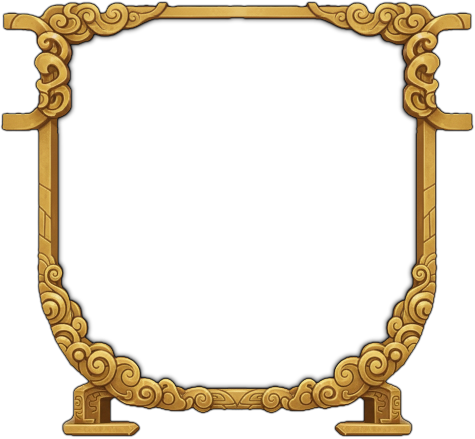

# Harmony Type

Harmony is one of the core features of the crafting system. Mods can add new harmony types through `window.modAPI.actions.addHarmonyType`. Use `RecipeHarmonyType` from `afnm-types` for the current built-in types.

```typescript
window.modAPI.actions.addHarmonyType(harmonyType: RecipeHarmonyType, config: HarmonyTypeConfig)
```

- **harmonyType**: A unique string identifier for your harmony type (e.g., 'elemental', 'temporal', 'chaos'). Note, as you are adding new and unknown harmony types you need to tell the compiler this is the case, by 'casting' the string to the RecipeHarmonyType 'elemental' as RecipeHarmonyType
- **config**: An object containing all configuration for the harmony type:

## HarmonyTypeConfig Fields

### 1. `name` (string, required)
The display name of your harmony type shown to players.

**Example:** "Elemental Balance"

### 2. `description` (Translatable, required)
Description explaining the harmony mechanics to players. Accepts a plain string or a translatable value and supports special formatting tags:
- `<name>text</name>` - Highlights important terms
- `<num>number</num>` - Highlights numbers
- `<li>item</li>` - Creates list items
- `<br/>` - Line breaks
- Standard HTML like `<span style="color: green">text</span>`

**Example:**
```typescript
description: `Balance the elements to maintain <name>Harmony</name>.
  <br/>
  Each action shifts the elemental balance:
  <li>Support: +<num>2</num> heat, -<num>1</num> cold</li>
  <li>Refine: +<num>2</num> cold, -<num>1</num> heat</li>`
```

### 3. `processEffect` (function, required)
Called once per crafting technique execution, after the technique's effects have been applied. Use this to implement per-technique harmony mechanics.

**Function Signature:**
```typescript
processEffect: (
  harmonyData: HarmonyData,
  technique: CraftingTechnique,
  progressState: ProgressState,
  entity: CraftingEntity,
  state: CraftingState,
  actionResolution?: CraftingActionResolution
) => void
```

**Parameters:**
- `harmonyData`: Store custom data for your harmony type here, in the `additionalData` field.
- `technique`: The crafting action that was just executed
- `progressState`: Current crafting progress (completion, perfection, harmony, etc.)
- `entity`: The player's crafting entity with stats and buffs
- `state`: Overall crafting state including the log
- `actionResolution`: Optional details of the resolved crafting action; check for `undefined` before reading it

**Common Operations:**
- Initialize custom data in `harmonyData.additionalData`. e.g. `harmonyData.additionalData = { heat: 0, cold: 0 }`
- Modify `progressState.harmony` based on player actions
- Add/remove buffs to `entity.buffs`
- Log messages to `state.craftingLog`
- Set `harmonyData.recommendedTechniqueTypes` to guide the player on the best crafting action types to use next (if relevant)

### 4. `onBarChange` (function, optional)
Fired after every individual completion or perfection change during a technique's execution. Use this for per-instance reactions, such as scoring harmony rewards or penalties each time a bar moves, rather than once at end of turn. Omit if your harmony only cares about end-of-turn state.

**Function Signature:**
```typescript
onBarChange?: (
  bar: 'completion' | 'perfection',
  harmonyData: HarmonyData,
  progressState: ProgressState,
  entity: CraftingEntity,
  state: CraftingState
) => void
```

**Parameters:**
- `bar`: Which bar changed (`'completion'` or `'perfection'`)
- `harmonyData`: Your harmony type's data object (same as in `processEffect`)
- `progressState`: Current crafting progress
- `entity`: Player's crafting entity
- `state`: Overall crafting state

**Example — scoring per-bar instead of per-technique:**
```typescript
onBarChange: (bar, harmonyData, progressState, entity, state) => {
  // Award +5 harmony each time the focused bar rises
  const data = harmonyData.additionalData as { focusedBar: 'completion' | 'perfection' };
  if (bar === data.focusedBar) {
    progressState.harmony += 5;
    state.craftingLog.push('Eccentric Decree: focused bar advanced. +5 harmony');
  } else {
    progressState.harmony -= 5;
    entity.stats.pool -= 5;
    state.craftingLog.push('Eccentric Decree: other bar advanced. -5 harmony, -5 Qi Pool');
  }
},
```

### 5. `initEffect` (function, required)
Called once when crafting begins to initialize your harmony type.

**Function Signature:**
```typescript
initEffect: (harmonyData: HarmonyData, entity: CraftingEntity) => void
```

**Common Operations:**
- Initialize your custom data structure in `harmonyData.additionalData`
- Apply starting buffs to the entity
- Set initial recommended techniques

### 6. `renderComponent` (function, required)
Returns a React component to display your harmony's visual state during crafting.

**Function Signature:**
```typescript
renderComponent: (harmonyData: HarmonyData) => ReactNode
```

**Guidelines:**
- Component should be positioned absolutely within the crafting interface
- Use Box components with proper positioning
- Access your custom data from `harmonyData.additionalData`
- Return visual feedback showing current state
- Can draw custom assets to be rendered, by drawing them on a blank image using the base cauldron background (below) as a guide. Do not include the cauldron itself in your new asset, simply use it as a guide for the image size and positioning of your new asset.


## Required display and progression fields

Also supply `shortDescription`, `icon` (a Material UI SVG icon component), `iconColour`, `iconBorderColour`, `complexityMultiplier`, `unlockFlag`, and `statTable`. The unlock flag controls whether players can select the harmony; set it through your teaching quest. `statTable` contains optional generators for clothing, talisman, artefact, cauldron, and mount stats.

`HarmonyData.additionalData` is `unknown`; narrow or cast it to your mod's data shape before reading its fields.

## Optional cost and starting harmony overrides

`qiCostMultiplier` and `stabilityCostMultiplier` receive `(technique: CraftingTechnique, harmonyData: HarmonyData)` and return a numeric multiplier for the action's live resource cost. For example, returning `0.5` halves the cost. These callbacks affect the displayed cost and the amount spent by the engine.

`startingHarmony` sets the initial harmony value for this harmony type. Omit it to use the default starting value.

## Complete Example

Save this JSX example in a `.tsx` file and import it from `src/modContent/index.ts`. The styles use MUI 9's `sx` prop, and the icon comes from the package root to use the game's shared icon runtime.


```tsx
import type { HarmonyData, RecipeHarmonyType } from 'afnm-types';
import { Box, Typography } from '@mui/material';
import { LocalFireDepartment } from '@mui/icons-material';

// This example stores only numeric fire/water levels in additionalData.
function elementData(harmonyData: HarmonyData): { fire: number; water: number } {
  return (harmonyData.additionalData ??= { fire: 5, water: 5 }) as { fire: number; water: number };
}

window.modAPI.actions.addHarmonyType('elemental' as RecipeHarmonyType, {
  name: 'Elemental Balance',
  shortDescription: 'Balance fire and water to gain harmony.',
  icon: LocalFireDepartment,
  iconColour: '#f44336',
  iconBorderColour: '#2196f3',
  complexityMultiplier: 1,
  unlockFlag: 'elemental_harmony_unlocked',
  statTable: { clothing: quality => ({ power: quality }) },

  description: `Balance fire and water elements to maintain <name>Harmony</name>.
    <br/>
    <br/>
    Actions affect element levels:
    <li>Fusion: +<num>3</num> fire</li>
    <li>Refine: +<num>3</num> water</li>
    <li>Support/Stabilize: +<num>1</num> to lower element</li>
    <br/>
    Perfect balance (both at 5): +<num>15</num> <name>Harmony</name>
    <br/>
    Imbalance: -<num>10</num> <name>Harmony</name> per point of difference`,

  processEffect: (harmonyData, technique, progressState, entity, state) => {
    // Initialize data if needed
    harmonyData.additionalData = harmonyData.additionalData || {
      fire: 5,
      water: 5
    };

    const data = elementData(harmonyData) as { fire: number; water: number };

    // Process technique effects
    if (technique.type === 'fusion') {
      data.fire = Math.min(10, data.fire + 3);
      state.craftingLog.push(`Fire element increased to ${data.fire}`);
    } else if (technique.type === 'refine') {
      data.water = Math.min(10, data.water + 3);
      state.craftingLog.push(`Water element increased to ${data.water}`);
    } else {
      // Support/Stabilize boost the lower element
      if (data.fire < data.water) {
        data.fire += 1;
      } else {
        data.water += 1;
      }
    }

    // Calculate harmony based on balance
    const diff = Math.abs(data.fire - data.water);
    if (diff === 0 && data.fire === 5) {
      progressState.harmony += 15;
      state.craftingLog.push(`Perfect balance! +15 harmony`);
    } else {
      progressState.harmony -= diff * 10;
      state.craftingLog.push(`Imbalance penalty: -${diff * 10} harmony`);
    }

    // Apply buffs based on dominant element
    if (data.fire > data.water) {
      entity.buffs = [{
        name: 'Fire Dominance',
        icon: 'flame.png',
        canStack: false,
        stats: {
          intensity: { value: 0.3, stat: 'intensity' }
        },
        effects: [],
        onFusion: [],
        onRefine: [],
        stacks: 1,
        displayLocation: 'none'
      }, ...entity.buffs.filter(b => b.name !== 'Fire Dominance' && b.name !== 'Water Dominance')];
    } else if (data.water > data.fire) {
      entity.buffs = [{
        name: 'Water Dominance',
        icon: 'water.png',
        canStack: false,
        stats: {
          control: { value: 0.3, stat: 'control' }
        },
        effects: [],
        onFusion: [],
        onRefine: [],
        stacks: 1,
        displayLocation: 'none'
      }, ...entity.buffs.filter(b => b.name !== 'Fire Dominance' && b.name !== 'Water Dominance')];
    }

    // Recommend techniques to balance
    if (data.fire > data.water + 2) {
      harmonyData.recommendedTechniqueTypes = ['refine'];
    } else if (data.water > data.fire + 2) {
      harmonyData.recommendedTechniqueTypes = ['fusion'];
    } else {
      harmonyData.recommendedTechniqueTypes = ['support', 'stabilize'];
    }
  },

  initEffect: (harmonyData, entity) => {
    harmonyData.additionalData = {
      fire: 5,
      water: 5
    };
    harmonyData.recommendedTechniqueTypes = ['fusion', 'refine'];
  },

  renderComponent: (harmonyData) => {
    const { fire, water } = elementData(harmonyData);

    return (
      <Box
        id="elemental"
        sx={{ display: 'flex', mt: 5.2, position: 'relative', justifyContent: 'center' }}
      >
        {/* Fit to the bounds of the cauldron */}
        <Box
          sx={{
            width: 'calc(min(35vw, 35vh))',
            height: 'calc(min(35vw, 35vh))',
            position: 'relative',
            overflow: 'visible',
          }}
        >
          <Box
            sx={{
              display: 'flex',
              position: 'absolute',
              zIndex: 21,
              top: 0,
              left: 0,
              width: '100%',
              height: '100%',
            }}
          >
            {/* Fire meter */}
            <Box
              sx={{
                flex: 1,
                display: 'flex',
                flexDirection: 'column',
                alignItems: 'center',
                position: 'absolute',
                zIndex: 21,
                top: 0,
                left: 0,
                width: '100%',
                height: '100%',
              }}
            >
              <Typography sx={{ color: 'red' }}>Fire: {fire}</Typography>
              <Box
                sx={{
                  width: '30px',
                  height: '60px',
                  bgcolor: 'rgba(255,0,0,0.2)',
                  border: '1px solid red',
                  position: 'relative',
                }}
              >
                <Box
                  sx={{
                    position: 'absolute',
                    bottom: 0,
                    width: '100%',
                    height: `${fire * 10}%`,
                    bgcolor: 'red',
                  }}
                />
              </Box>
            </Box>

            {/* Water meter */}
            <Box
              sx={{
                flex: 1,
                display: 'flex',
                flexDirection: 'column',
                alignItems: 'center',
                position: 'absolute',
                zIndex: 21,
                top: 0,
                right: 0,
                width: '100%',
                height: '100%',
              }}
            >
              <Typography sx={{ color: 'blue' }}>Water: {water}</Typography>
              <Box
                sx={{
                  width: '30px',
                  height: '60px',
                  bgcolor: 'rgba(0,0,255,0.2)',
                  border: '1px solid blue',
                  position: 'relative',
                }}
              >
                <Box
                  sx={{
                    position: 'absolute',
                    bottom: 0,
                    width: '100%',
                    height: `${water * 10}%`,
                    bgcolor: 'blue',
                  }}
                />
              </Box>
            </Box>
          </Box>
        </Box>
      </Box>
    );
  },
});
```


## Assigning a Harmony Type

Set `harmonyTypeOverride` on an individual recipe to use your registered harmony type. Define `baseRecipe` as a complete `RecipeItem` first.

```typescript
const elementalRecipe: RecipeItem = {
  ...baseRecipe, // A complete RecipeItem defined earlier; override its harmony below
  harmonyTypeOverride: 'elemental' as RecipeHarmonyType,
}
```

## Best Practices

1. **Balance Risk/Reward**: Higher harmony bonuses should require more skill or risk
2. **Clear Visual Feedback**: Your render component should clearly show the current state
3. **Informative Logging**: Use `state.craftingLog.push()` to explain what is happening
4. **Buff Management**: Always filter out old buffs before applying new ones with the same name
5. **Recommended Techniques**: Use `harmonyData.recommendedTechniqueTypes` to guide players
6. **Per-bar Reactions**: Use `onBarChange` when you need to react to individual bar changes, not just end-of-turn state

## Utility Functions

Common utilities available in harmony implementations:

```typescript
// Colour formatting for logs
const col = (content, color) => `<span style="color: ${color}">${content}</span>`;

// Technique type formatting
const fusion = `<span style="color: lime">Fusion</span>`;
const refine = `<span style="color: cyan">Refine</span>`;
const support = `<span style="color: #eb34db">Support</span>`;
const stabilize = `<span style="color: orange">Stabilize</span>`;
```
